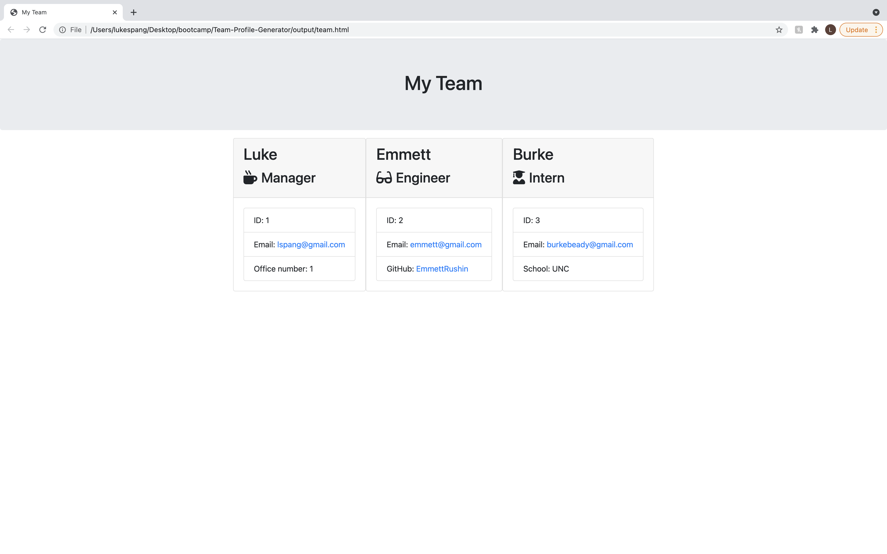

# Team-Profile-Generator

<h1 align="center">Team Profile Generator</h1>

 
    
## Description

This application uses the inquirer package to take user input about a project team and create an HTML document containing the team members information in individual cards. The project runs completely in a node.js command line.

 

## License

This project/application is covered under the Apache license.

 

## Table of Contents

* [Install](#Install)
* [Usage](#Usage)
* [Contribute](#Contribute)
* [Tests](#Tests)
* [Questions](#Questions)
 

 
    

## Install

In order to install this application run the command below:

You can clone from LukeSpang github repository.

 

## Usage

You can use inquirer to enter information into the command line.

 

## Contribute

Contributors can reach out to the creator using the information below.

 

## Tests

Run `npm test .` to run jest on the included test documents.

 

## Questions

If there are any questions regarding the repo, or any techincal issues, please feel free to contact me at my personal email: Lspang20@gmail.com. You can also find me at (https://github.com/LukeSpang)
    

